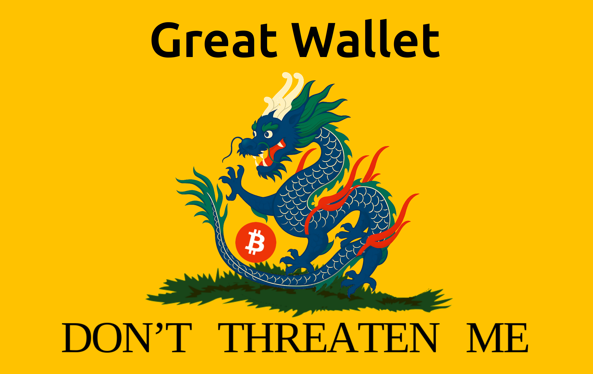

  

<h1 align="center">Yuri da Silva Villas Boas</h1>

  <strong>Applied Cryptographer</strong> 
  Coercion-resistant Bitcoin self-custody · author of BIP-450 · Great Wall

  <a href="https://twitter.com/yurivillasboas">X</a> ·
  <a href="https://njump.me/yurisvb@nostrplebs.com">Nostr</a> ·
  <a href="https://www.linkedin.com/in/yuri-da-silva-villas-boas-a1995143/">LinkedIn</a>

---

Self-custody advice tells you to hide, deny, and keep a decoy. All three are
bets on what the attacker believes. None of them has ever been assessed as what
it is: a security mechanism whose entire strength depends on the adversary's
ignorance.

## 📄 Papers

Both open access, both free, neither behind a signup.

**💀 [The Deadly Race](https://doi.org/10.5281/zenodo.22018891)**
`10.5281/zenodo.22018891` — You cannot prove you forgot. Any scheme that leaves
an attacker a feasible-but-unfinished path to the funds leaves you a competing
racer for the same balance, and a racer within reach is priced. Ends at a design
criterion you can apply to your own setup: the attack must clearly succeed or
clearly fail, never become a race.

**🌀 [The Denial Spiral](https://doi.org/10.5281/zenodo.22778480)**
`10.5281/zenodo.22778480` — A denial's credibility is a commons. It is produced
by every holder and consumed by each one who denies, so once denial becomes the
expected script it stops carrying information, and the cost falls hardest on
whoever most needs to be believed — including people who hold nothing at all.

Both build on [Jameson Lopp's public registry of physical
attacks](https://github.com/jlopp/physical-bitcoin-attacks). New incident data
goes **upstream to that registry**, never into a private dataset: it is public
property and belongs to everyone, including whoever is next.

## 📜 Standards

**[BIP-450 — Formosa](https://github.com/bitcoin/bips/blob/master/bip-0450.mediawiki)**
A forwards- and backwards-compatible expansion of BIP-39 that maps seed entropy
onto grammatical sentences instead of word lists. In the Bitcoin standards
repository. [Reference implementation](https://github.com/Yuri-SVB/formosa).

## 🧰 Projects

**🐉 [Great Wall](https://github.com/Yuri-SVB/Great-Wallet)** — coercion-resistant
self-custody through Tacit Knowledge-Based Authentication: memory-held entropy
navigated against a user-specific perturbation of a fractal. Kerckhoffian and
coercion-resistant at the same time.
**The implementation is a prototype. Do not put savings behind it yet.**

**🎲 [BTC-D20](https://github.com/Yuri-SVB/BTC-D20)** — a printable kit for
generating a BIP-39 seed with a 20-sided die, in four languages. Entropy you
watch happen, no electronic RNG anywhere. Finished, and needs nothing to keep
working.

**🔬 [Research](https://github.com/Yuri-SVB/great-wall-docs)** — the threat model,
the cost analysis, and the registry coding behind the papers.

**🔐 [SRVB](https://github.com/Yuri-SVB/SRVB-Cryptography)** ·
**[LVBsig](https://github.com/Yuri-SVB/LVBsig/blob/main/docs/white_paper.md)** —
earlier cryptographic work.

## 🔎 Self-custody audit

I read the arrangement you already have — hardware wallet, passphrase, multisig,
decoy, inheritance plan, whatever there is — and answer four questions in a
closed report:

1. **Is your security based on a secret trick?** Does it depend on the attacker
   not knowing what you do, and how you do it?
2. **After your devices and secrets are seized, could the attacker spend
   immediately — or only eventually, after some time?** "Eventually" means you
   are still a competing racer for the same balance.
3. **Is your custody strictly individual?** Can anyone else do something that
   stops you reaching your own coins?
4. **Does it depend on particular objects in particular places?** And do you own
   those places?

**I never ask for your seed, your balances, your addresses or where you live.**
The audit works on the shape of your arrangement, not its contents. An auditor
of coercion resistance who collected holder data would be assembling exactly the
list the papers condemn.

What I will not do is build a decoy with denial training. That is the most
requested service and the only one I refuse, for the whole argument of *The
Denial Spiral*.

Contact: yuri@t3infosecurity.com

## ⚡ Support

Great Wall, BTC-D20, BIP-450 and the papers are MIT or Apache-2.0, and that does
not change: no "pro" version, no feature unlocked by payment, no priority queue
for donors. What is sold is time, not software.

[**Support**](https://github.com/Yuri-SVB/support) takes Lightning and on-chain,
with no signup and nothing expected in return. What has actually shipped is
logged, dated, in git history that anyone can audit:
[`DELIVERED.md`](https://github.com/Yuri-SVB/support/blob/main/DELIVERED.md).

## ✍️ Selected writing

- [*Esconder seu bitcoin ainda protege você?*](https://bitcoinblock.com.br/2026/09/22/esconder-bitcoin-ainda-protege/) — Bitcoin Block, 2026 (pt-BR)
- [Introducing the SRVB cryptosystem](https://www.toptal.com/algorithms/introducing-srvb-cryptosystem) — Toptal
- [Formosa: crypto wallet management](https://www.toptal.com/developers/blockchain/formosa-crypto-wallet-management) — Toptal
- [MSc thesis](https://repositorio.ufsc.br/handle/123456789/235360) — UFSC
- [IEEE Xplore 9092355](https://ieeexplore.ieee.org/document/9092355) · [9239493](https://ieeexplore.ieee.org/document/9239493) — conference papers
